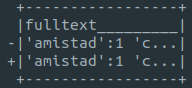
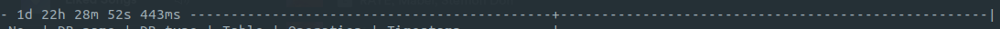
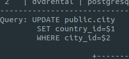

# Database watcher


Dbw is a console application that displays changes in real time in any number of Oracle or PostgreSQL databases. It does that by creating triggers on tables that were specified in a YML config file and an audit table in which every record represents an individual insert, update or delete operation. When it comes to detecting and keeping track of said operations, the database does all the work. The application merely frequently checks if new records were added to the audit table and outputs them in the console in a readable form. 

This application has been written to help developers in their daily work on large systems, in which a single action can result in changes to many different tables in the database. Dbw instantly displays before and after states of an updated row and contents of insterted or deleted rows, saving the developer the trouble of querying the database with tools that he or she might use or analyzing the applications code to find out what happens after a given action. 

## Configuration

An example PostgreSQL configuration file:
```
database:
    name      : example
    schema    : example_schema
    type      : postgresql
    host      : "127.0.0.1"
    port      : 5432
    user      : christoph
    password  : pwd1234
settings:
    operationsMinimum: 100
    operationsLimit: 10000
tables:
    - film
    - actor
    - address
    - inventory
    - language
    - staff
```

An example Oracle configuration file:
```
database:
    name                : christoph
    type                : oracle
    connectionString    : jdbc:oracle:thin:@localhost:32118:XE
    user                : christoph
    password            : pwd1234
    driverPath          : /home/christoph/dbw/lib/ojdbc7.jar
settings:
    operationsMinimum: 100
    operationsLimit: 10000
tables:
    - FILM
    - ACTOR
    - ADDRESS
    - INVENTORY
    - LANGUAGE
    - STAFF
```

In the `database` dictionary, `host` and `port` mappings can be replaced with a `connectionString` for a PostgreSQL configuration, whereas for an Oracle DB there can be only a `connectionString` mapping. 
`tables` is a collection of table names that will be watched. 

The `schema` is specific for PostgreSQL and is set to `public` by default. 

The `driverPath` mapping is optional and is an easier way of adding a JDBC driver to the classpath; when specified, the relevant driver class will be loaded at runtime, without the need of using the `cp` flag in the `java` command. The provided value has to be an absolute path. 

There are two available mappings in the `settings` dictionary:  
`operationsMinimum` - the number of operations that will remain in the audit table after the deletion caused by the exceeded limit.  
`operationsLimit` - the maximum number of operations stored in the audit table. When this limit is reached, Dbw will automatically delete the given number of records reduced by the `operationsMinimum` value the from the audit table.  
To further explain the mappings described above, if for example `operationsLimit` is set to 10 000, the `operationsMinimum` is 100 and the registered operations count reaches 10 000, then 9 900 operations will be deleted from the audit table.   

## Usage

After launching, Dbw first evaluates the list of tables provided in the configuration file and creates new triggers for new tables in the collection or drops the ones that there is no corresponding table name for. An audit table named `DBW_AUDIT` is created during the initial application start for a given database and can be removed when the user explicitly wants to drop all Dbw related database objects using the `-p` flag. 

An example application start for PostgreSQL configuration:
```
java -cp ./dbw.jar com.dbw.app.Dbw -c ./postgres-example-config.yml
```

An example application start for Oracle configuration:
```
java -cp lib/ojdbc7.jar:./dbw.jar com.dbw.app.Dbw -c ./oracle-example-config.yml
```

An example application start for both PostgreSQL and Oracle configurations:
```
java -cp lib/ojdbc7.jar:./dbw.jar com.dbw.app.Dbw -c ./oracle-example-config.yml,./postgres-example-config.yml
```

Note that in order to use Dbw with an Oracle database, you will have to add an Oracle JDBC driver to the classpath as shown above (`lib/ojdbc7.jar` for example) or by adding a `driverPath` mapping to the configuration file.

To close the application, press Ctrl+C.

### CLI

```
 -c,--config <arg>                        provide one or more
                                          comma-separated paths to
                                          configuration files
 -C,--clear-cache                         clear the given config's cache
 -d,--debug                               show exception classes and stack
                                          traces
 -D,--delete-first-n-rows <arg>           delete the first n rows from the
                                          audit table (* if all)
 -h,--help                                show help
 -i,--interval <arg>                      set the interval in milliseconds
                                          in which the application checks
                                          whether there were changes in
                                          the watched databases (default:
                                          500ms)
 -l,--latest <arg>                        show the latest operations after
                                          the app starts. Accepts a number
                                          or a number combined with the
                                          seconds, minutes or hours
                                          symbol, where for example 3
                                          means three latest operations
                                          and 3s means all operations from
                                          the last 3 seconds - use "m" or
                                          "h" for minutes or hours
 -o,--one-off                             show the database operations
                                          matching with the given
                                          --latest-changes flag value and
                                          close the application (don't
                                          start the watchers)
 -p,--purge                               remove all database objects
                                          created by the application
 -q,--query                               show the SQL query for each
                                          operation (PostgreSQL only)
 -R,--reuse-config                        reuse the last chosen config
                                          file paths
 -t,--tables <arg>                        narrow down the tables you'd
                                          like to watch, accepts a single
                                          table or comma-separated list of
                                          tables
 -T,--time-diff-separator-min-val <arg>   specify the time in milliseconds
                                          after which a time difference
                                          separator will appear between
                                          operation outputs (default:
                                          5000)
 -V,--verbose-diff                        show verbose output, i.e. with
                                          full before and after states of
                                          column values that exceeded the
                                          maximum column width
 -w,--max-column-width <arg>              specify the maximum width of a
                                          column (default: 17)
 -W,--max-row-width <arg>                 specify the maximum width of a
                                          row (default: 120)
```

#### Config files

The `-c,--config` flag accepts comma-separated paths to config files like so: `/example/path/to/config1.yml,/example/path/to/config2.yml`.  
If paths to config files haven't been specified with the `-c,--config` flag, Dbw will list all YML files from the current directory and ask the user to choose one or more.
  
To load one config file, insert its number from the list and press Enter.  
To load multiple config files, insert their numbers from the list and press Enter (e.g. `2,4,5`).

#### Cleanup

Purge (`-p, --purge` flag) will remove any trace of Dbw from the database by removing all previously created database objects.

#### One-off output

An example of the `-o,--one-off` flag's usage:  
```
java -cp ./dbw.jar com.dbw.app.Dbw -c ./postgres-example-config.yml -l30m -o
```
The combination of `-l,--latest-changes` and `-o,--one-off` will cause the application to display all operations from the last 30 minutes and shutdown. `-o,--one-off` has to be used together with `-l,--latest-changes`, because otherwise Dbw wouldn't know how many operations to display in the single requested iteration. This option is meant to be used when the user wants to have a brief look at a given number of operations or all operations from a given period. 

#### Output width

Because of the variety of terminal window widths, there are options to customize the widths of displayed columns and rows. Specified widths are maximum values, which means that if the `w` flag is set to 50 and the actual column value's character count is 20, the displayed column's width will be 20. Column name is also taken into account, so if the column's name is `release_year` and its value is `2006`, the displayed column's width will be 12 (length of `release_year`).

Default 120 row width (-W):  


40 row width (-W):  


Default 17 column width (-w):  


100 column width (-w):  


Some adjustments may be necessary as too short or too long widths can cause the output to be unreadable. 

### Multiple watchers

As mentioned in the "Config files" paragraph, it's possible to watch multiple databases at once. When multiple databases are being watched, Dbw will mesh the operations from all data sources during each iteration and sort them by their timestamps - this means that if operations A and B have been carried out at `00:00:00` and `00:00:05` in database A and operation C has been carried out at `00:00:02` in database B, then the order in which the corresponding operation outputs are displayed will be A,C,B.

### Output

The paragraphs below describe every part of the operation's output from top to bottom. 

#### Separator with time between operations

Operation outputs are separated by hyphen lines, which incorporate the time that has passed since the last operation.  
  
The time between operations is represented by days, hours, minutes, seconds and milliseconds. In the example above: 1 day, 22 hours, 28 minutes, 52 seconds and 443 milliseconds passed since the last operation. This information can be used to measure the watched application's performance and identify bottlenecks. For example, when watching a shopping application's database, a user buys a product and the time between an update operation in the `Products` table and an update operation in the `Basket` table is 5 seconds (`5s`) - this means that the code between these two operations needs optimization. 

#### Header

An individual operation output starts with a header table that contains: audit record's number, name of the table on which the operation has been carried out, operation type and a timestamp. If more than one database is being watched, there's also the database name and type.  
  
The header above describes the eighth update operation carried out on a PostgreSQL database named `dvdrental`, on the table `city`, at `04-05-2021 07:58:51`.

#### Query

  
The SQL query that caused the given operation is shown below the header table when the `-q,--query` flag is used. This feature works only for PostgreSQL databases.

#### Body

Next are the modified table's columns with their values, organized into rows. In case of an update:  
  
From top to bottom there's the column name, value before (`-` prefix), value after (`+` prefix). 

Updated columns are bordered:  
  
`replacement_cost` column has been updated, whereas the values of `length` and `rating` remained the same.

#### Verbose diff

In many cases the column's value is too long to be displayed in the columns part of the output. If the value exceeds the maximum length of a column, it will get truncated and ended with an ellipsis.  
With the `-V,--verboseDiff` flag, values that got truncated and were updated in the given operation, are fully displayed below the columns section. For example, if the date in `last_update` column was too long:  


#### Time separator

  
The time separator can be used for better readability. The minimum time for it to be displayed is specified by the `-T,--time-diff-separator-min-val` flag and is set to 5 seconds by default. For example, to display the time separator when the time between operations exceeds 15 seconds, use the `-T` flag like so: `-T15000`.

### Caching

Dbw saves the config file's checksum in the `dbw.cache` file, which is created in the current directory after the first launch. The current and previous checksums are compared during the app's initialization and if they are different, i.e. the config file has been modified, Dbw will carry out the evaluation described in the Usage section of this instruction. 

## Requirements

JRE 8 or above

## Tested on

OS:  
  - Ubuntu 20.04 LTS, 
  - Windows 10

DBs:  
  - PostgreSQL 12.1, 
  - Oracle Database 18c Express Edition (XE)

## License

MIT