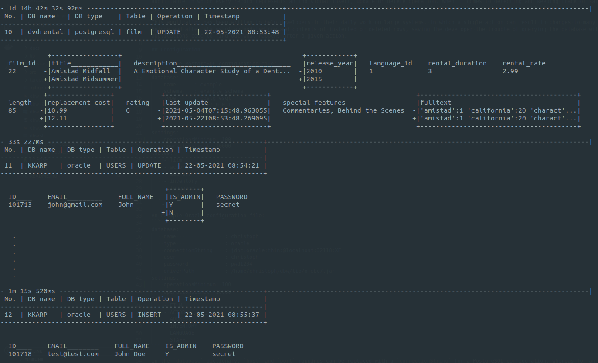
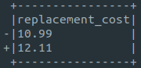
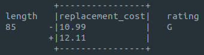

# Database watcher



Dbw is a console application that displays changes in a given Oracle or PostgreSQL database. It does that by creating triggers on tables that were specified in a YML config file and an audit table in which every record represents an individual insert, update or delete operation. When it comes to detecting and keeping track of said operations, the database does all the work. The application merely frequently checks if new records were added to the audit table and outputs them in the console in a readable form. 

This application has been written to help developers in their daily work on large systems, in which a single action can result in changes to many different tables in the database. Dbw instantly displays before and after states of an updated row and contents of insterted or deleted rows saving the developer the trouble of querying the database with tools that he or she might use or analyzing the applications code to find out what happens after a certain action. 

## Configuration

An example PostgreSQL configuration file:
```
database:
    name      : example
    type      : postgresql
    host      : "127.0.0.1"
    port      : 5432
    user      : christoph
    password  : pwd1234
tables:
    - film
    - actor
    - address
    - inventory
    - language
    - staff
```

An example Oracle configuration file:
```
database:
    name                : christoph
    type                : oracle
    connectionString    : jdbc:oracle:thin:@localhost:32118:XE
    user                : christoph
    password            : pwd1234
tables:
    - FILM
    - ACTOR
    - ADDRESS
    - INVENTORY
    - LANGUAGE
    - STAFF
```

In the `database` dictionary, `Host` and `port` mappings can be replaced with a `connectionString` for a PostgreSQL configuration, whereas for an Oracle DB there can be only a `connectionString` mapping. 
`tables` is a collection of table names that will be watched.

## Usage

After starting, Dbw first evaluates the list of tables provided in the configuration file and creates new triggers for new tables in the collection or drops the ones that there is no corresponding table name for. An audit table named `DBW_AUDIT` is created during the initial application start for a given database and can be removed when the user explicitly wants to drop all Dbw related database entities using the `-p` flag. 

An example application start for PostgreSQL configuration:
```
java -cp ./dbw.jar com.dbw.app.Dbw -c ./postgres-example-config.yml
```

An example application start for Oracle configuration:
```
java -cp lib/ojdbc7.jar:./dbw.jar com.dbw.app.Dbw -c ./oracle-example-config.yml
```

Note that in order to use Dbw with an Oracle database, you will have to add an Oracle JDBC driver to the classpath as shown above (`lib/ojdbc7.jar` for example).

To close the application, use Ctrl+C.

### CLI

```
 -c,--config <arg>             provide a path to the configuration file
 -d,--debug                    show exception classes and stack traces
 -D,--deleteFirstNRows <arg>   delete the first n rows from the audit
                               table (* if all)
 -l,--maxColumnLength <arg>    specify the maximum length of a column
                               (default: 17)
 -L,--maxRowLength <arg>       specify the maximum length of a row
                               (default: 120)
 -n,--lastNChanges <arg>       specify the number of last changes to
                               display after the app starts
 -p,--purge                    remove database audit table, functions and
                               triggers
```

All flags except `-c, --config` are optional.  
After starting the app with any flag except `-p, --purge` the database watcher will initiate. 

Because of the variety of terminal window widths, there are options to customize the lengths (in characters) of displayed columns and rows. Specified lengths are maximum values, which means that if the `l` flag is set to 50 and the actual column value's length is 20, the displayed column's length will be 20. Column name is also taken into account so if the column's name is `description` and its value is `2006` the displayed column's length will be 11 (length of the word `description`).

Default 120 row length:  


60 row length:  


Default 17 column length:  


100 column length:  


Too short or too long lengths can cause the output to be unreadable so some adjustments may be necessary. 

### Output

Operation outputs are separated by hyphens. An individual operation output starts with a header with the audit record's ID number, name of the table on which the operation has been carried out, operation type and a timestamp.

Next are the modified table's columns with their values. In case of an update:  


From top to bottom there's the column name, value before, value after. 

Updated columns are bordered:  
  
`release_year` column has been updated, and `description` hasn't.

In many cases the column's value is too long to be displayed in the columns part of the output. If the value exceeds the maximum length of a column, it will get truncated and ended with an ellipsis. 
Values that got truncated and were updated in the given operation, are displayed below the columns section fully. For example, if the date in `last_update` column was too long:  


## Requirements

Java 8 or above

## Tested on

OS:
  - Ubuntu 20.04 LTS, 
  - Windows 10

DBs:
  - PostgreSQL 12.1,
  - Oracle Database 18c Express Edition (XE)

## License

MIT